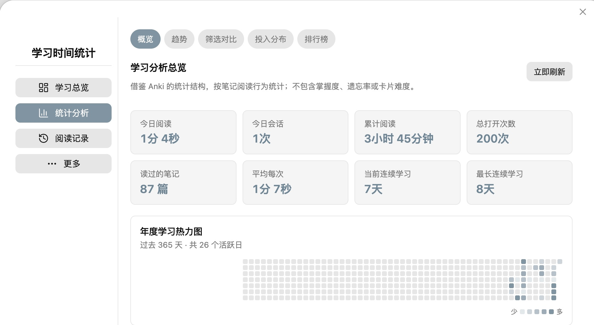
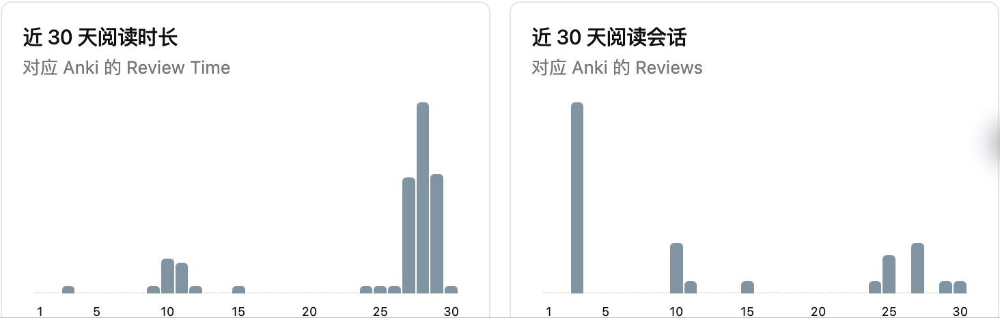

# Study Time Statistics

**English (this page)** · [中文完整版](README_zh.md) · [中文摘要](#中文摘要)

> This repository is documented in both English and Chinese. The English documentation appears first, followed by a Chinese summary on the same page.

Study Time Statistics is a privacy-first Obsidian plugin that measures how you study across notes and PDFs. It combines unobtrusive per-note metrics with an Anki-inspired analytics dashboard—without adding anything to your Markdown files.



*Actual Obsidian interface, captured on 2026-10-02 from a 3.0.0 development build. At capture time, the public release was 2.2.0, so some controls may differ. This is a direct crop of aggregate statistics—not a UI mockup. No note titles, paths, folders, or contents are shown.*

## Highlights

- Automatically track active reading time for Markdown notes and PDFs.
- Count opens and completed reading sessions per note.
- Show an inline statistics strip at the top of every note. It belongs to the view, scrolls away with the note, and never changes the source file.
- Display opens, total time, average time per visit, longest session, active days, current streak, and last read time.
- Explore day, week, month, year, and all-time statistics.
- Review a 365-day heatmap, 30-day time and session trends, hourly and weekday patterns, session-length distribution, folder summaries, and recent sessions.
- Review every recorded session, add a missed session, or correct and delete inaccurate entries without editing plugin data by hand.
- Create timestamped local backups and restore the latest backup from the dashboard or Command Palette.
- Optionally record self-reported **reading coverage** for each visit. Coverage describes how much content you reached—not how much you understood, remembered, or mastered.
- Explore per-note and folder coverage, a 365-day coverage heatmap, hourly patterns, estimated covered characters, and character-based reading pace.
- Set private daily and weekly study targets, follow a 28-day goal trend, and review ambiguous long sessions without automatic deletion.
- Start from a Study Overview that combines goals, week-over-week change, session quality, high-investment hours, and a conservative revisit queue.
- Track optional start/end position and manual or estimated characters read, then compare unique reach, repeated reading, equivalent passes, and time per 1,000 characters.
- Classify new sessions from local interaction signals as interactive, quiet study, needs review, or unclassified. Ambiguous sessions are never silently discarded.
- Rank notes by most opens, longest total reading time, longest average visit, longest single session, and most active days.
- Pause tracking when Obsidian is not focused by enabling Strict mode.
- Keep all statistics inside the local vault—no account, telemetry, advertising, or cloud upload.

## Real, anonymized snapshot

The captured development build shows **87 notes read**, **200 opens**, and **3h 45m** of recorded reading time as of 2026-10-02. These are the owner's real, point-in-time aggregate values, shared with permission—not sample data, a benchmark, or a live counter. The screenshot excludes note-level rankings and all private titles, paths, folders, and contents.



*The two 30-day charts are another direct crop of the same interface capture. We show aggregate views here to keep private note details out of public screenshots.*

## Open the dashboard

Select the bar-chart icon in the left ribbon, or open the Command Palette and run **Open Study Time Statistics**. The current dashboard has four main areas: **Study overview**, **Analytics**, **Records**, and **More**. Rankings and filtered analysis live under Analytics; sessions, reading coverage, and goals live under Records; reports, data management, and feedback live under More. Reading Coverage is off by default and can be enabled from its page or the plugin settings.

## Installation

### Community Plugins

Study Time Statistics is available in the Obsidian Community Plugins directory. Open **Settings → Community plugins → Browse**, search for **Study Time Statistics**, and select **Install**.

[View Study Time Statistics in the Obsidian plugin directory](https://obsidian.md/plugins?id=study-time-statistics)

### Manual installation

1. Download `main.js`, `manifest.json`, and `styles.css` from the latest GitHub release.
2. Create `<vault>/.obsidian/plugins/study-time-statistics/`.
3. Copy the three files into that directory.
4. Restart Obsidian, then enable **Study Time Statistics** under **Settings → Community plugins**.

## Privacy and storage

All data stays under `.obsidian/plugins/study-time-statistics/` in your own vault. The plugin stores note paths and local study metrics needed for its charts. When Reading Coverage is enabled, it also stores self-reported percentages, note character-count snapshots, related active durations, and local interaction counts and timestamps. It never stores note contents. Timestamped backups are saved to `Study Time Statistics Backups/` in the vault and therefore contain the same private note paths and metrics. It does not send data over the network. The public screenshots contain a permissioned, point-in-time snapshot of real aggregate values, but no note title, path, folder, or content field is visible.

### Syncing between devices

The plugin does not implement or require a separate cloud service. If your whole vault—including its `.obsidian` configuration folder—is synchronized by Obsidian Sync, iCloud Drive, Nutstore, or another file-sync provider, the plugin data can travel with that vault according to the provider's settings. Enable configuration-folder syncing on every device and avoid editing the same data concurrently while a provider is still resolving conflicts. Backups in `Study Time Statistics Backups/` may also be synchronized because they are normal vault files.

## Feedback and support

The dashboard includes a **Feedback** page that opens the appropriate GitHub form for bugs, inaccurate statistics, feature requests, or discussions. The plugin never submits study data automatically; nothing is sent until the user explicitly submits a GitHub form.

- [Report a bug](https://github.com/tanzy226/obsidian-study-time-statistics/issues/new?template=bug_report.yml)
- [Report inaccurate statistics](https://github.com/tanzy226/obsidian-study-time-statistics/issues/new?template=data_accuracy.yml)
- [Suggest a feature](https://github.com/tanzy226/obsidian-study-time-statistics/issues/new?template=feature_request.yml)
- [Ask a question or share an idea](https://github.com/tanzy226/obsidian-study-time-statistics/discussions)

Before posting screenshots or logs, replace private note titles and paths with anonymous examples.

## Development

```bash
npm install
npm test
npm run build
```

The production build generates `main.js`. A GitHub release must include `main.js`, `manifest.json`, and `styles.css`, with a tag matching the version in `manifest.json` exactly.

## Compatibility

- Obsidian 1.13.0 or later
- Desktop and mobile manifests are supported; background-focus behavior depends on the operating system

## Credits and license

Study Time Statistics is an independent plugin inspired by Anki's statistical presentation. It is not affiliated with or endorsed by Anki.

The codebase is derived from [AstraDev's open-source Obsidian time tracker](https://github.com/astradev123/obsidian-focus-time), used under the Apache License 2.0. Original copyright notices and license terms are preserved. See [LICENSE](LICENSE) and [NOTICE](NOTICE).

---

## 中文摘要

Study Time Statistics（学习时间统计）是一款本地隐私优先的 Obsidian 插件，用来统计 Markdown 笔记和 PDF 的有效阅读时间、打开次数、平均每次阅读、最长单次阅读、活跃天数和连续学习天数。每篇笔记顶部的统计条属于界面层，会随正文滚动消失，不会写入或修改 Markdown 原文。

仪表盘提供日、周、月、年和全部时间范围，并包含 365 天热力图、近 30 天趋势、时段与星期分布、会话时长分布、文件夹汇总、最近会话，以及按打开次数、累计阅读、平均阅读、最长单次和活跃天数排列的榜单。1.3.0 新增学习目标与会话复核；2.0.0 新增学习总览；2.1.0 新增阅读起止位置、手填/估算阅读字符、重复阅读量、等效通读遍数和每千字用时。覆盖度与位置都不代表吸收、理解、记忆或掌握程度。

上方图片是 2026-10-02 从实际 Obsidian 界面直接裁切的截图，显示当时 **87 篇已读笔记、200 次打开、累计 3 小时 45 分钟**。截图来自当时尚未公开发布的 3.0.0 开发版；截取时公开最新版为 2.2.0，部分控件可能不同。公开图片仅展示汇总数据，没有笔记标题、路径、文件夹或正文。

所有学习数据仅保存在本地库中，插件不上传数据、不收集遥测、无广告，也不需要云端账户。若整库同步包含 `.obsidian` 配置文件夹，数据可随 Obsidian Sync、iCloud、坚果云等现有方案同步，无需插件另建同步服务。完整中文说明见 [README_zh.md](README_zh.md)。
