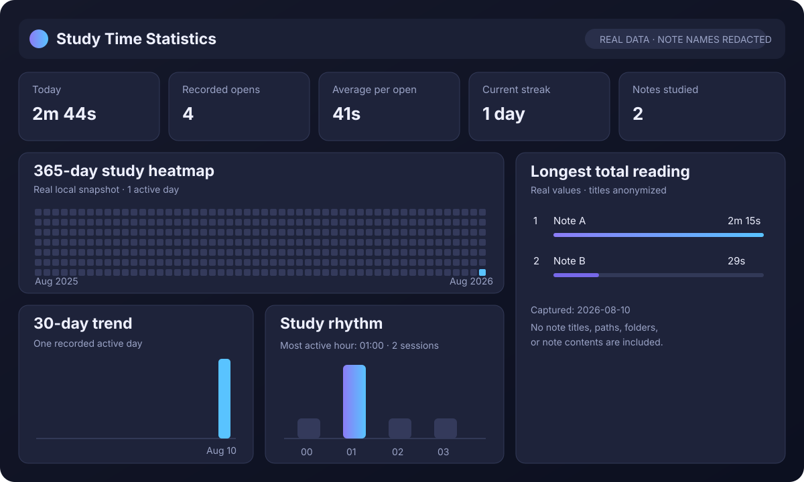
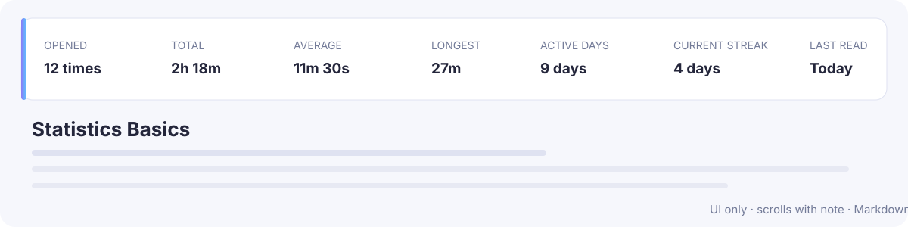

# Study Time Statistics（学习时间统计）

[English](README.md)

Study Time Statistics 是一款注重隐私的 Obsidian 学习时间统计插件。它会统计你阅读每篇笔记和 PDF 的投入，并把单篇笔记数据与参考 Anki 统计结构设计的完整仪表盘结合起来，同时绝不向 Markdown 原文写入任何内容。



## 主要功能

- 自动统计 Markdown 笔记和 PDF 的有效阅读时间。
- 记录每篇笔记的打开次数和已完成阅读会话。
- 在每篇笔记顶部显示统计条。统计条属于阅读界面，会随着笔记一起向上滚动并消失，不固定悬浮，也不会修改 Markdown 原文。
- 单篇笔记显示：打开次数、累计阅读、平均每次、最长单次、活跃天数、当前连续天数和最近阅读时间。
- 查看日、周、月、年和全部时间范围的数据。
- 提供过去 365 天学习热力图、近 30 天时长与会话趋势、24 小时分布、星期分布、单次时长分布、文件夹汇总和最近会话。
- 查看全部已记录会话，补记遗漏的学习记录，或修改、删除不准确的会话。
- 从仪表盘或命令面板创建带时间戳的本地备份，并恢复最近一次备份。
- 可选记录每次阅读的 **阅读覆盖度**。它只表示这次读到了多少内容，不代表理解、记忆、吸收或掌握程度。
- 查看单篇与文件夹覆盖汇总、365 天覆盖热力图、时段分布、估算覆盖字符数和基于字符的阅读节奏。
- 设置完全本地的日目标与周目标，查看 28 天达标趋势，并人工复核可能是静默学习或挂机的长会话。
- 使用默认打开的“学习总览”，集中查看目标、周环比、会话质量、高投入时段和保守的建议回看队列。
- 可选记录阅读起止位置和本次阅读字符数；区分手填与估算，并统计不同字符、重复阅读量、等效通读遍数和每千字用时。
- 使用本地交互信号把新会话标记为“持续交互”“静默学习”“需确认”或“未分类”；有歧义的时间不会被插件静默删除。
- 提供五类排行榜：打开次数最多、累计阅读最长、平均每次最长、最长单次阅读、活跃天数最多。
- 严格模式下，Obsidian 窗口失去焦点时暂停计时。
- 所有统计均保存在本地库中：无需账号、无遥测、无广告、无云端上传。



## 真实匿名化示例

下面的数据来自插件在 2026-08-10 保存的真实统计快照，并已获得数据所有者许可。所有真实笔记标题、路径、文件夹和正文均已删除，只保留汇总数值。

| 笔记 | 打开次数 | 累计阅读 | 平均每次 | 最长单次 |
| --- | ---: | ---: | ---: | ---: |
| Note A | 2 | 2分15秒 | 1分08秒 | 1分37秒 |
| Note B | 2 | 29秒 | 15秒 | 27秒 |

该快照合计：**2 篇笔记、4 次打开、累计阅读 2 分 44 秒**。这只是某一时点的公开示例，不会随着数据所有者的笔记库继续更新。

## 打开仪表盘

点击左侧边栏的柱状图图标，或者打开命令面板并运行 **打开学习时间统计**。仪表盘包含“排行榜”“学习数据”“学习分析”“学习目标”“会话明细”和“阅读覆盖度”；会话纠错与备份功能位于“会话明细”。“阅读覆盖度”默认关闭，可在该页面或插件设置中开启。

## 安装

### 社区插件市场

插件已收录到 Obsidian 社区插件目录。打开 **设置 → 第三方插件 → 浏览**，搜索 **Study Time Statistics** 即可安装。

[在 Obsidian 插件目录中查看 Study Time Statistics](https://obsidian.md/plugins?id=study-time-statistics)

### 手动安装

1. 从最新 GitHub Release 下载 `main.js`、`manifest.json` 和 `styles.css`。
2. 新建 `<你的库>/.obsidian/plugins/study-time-statistics/`。
3. 将三个文件复制到该目录。
4. 重启 Obsidian，然后在 **设置 → 第三方插件** 中启用 **Study Time Statistics**。

## 隐私与数据位置

全部数据只保存在你自己的库内，位置为 `.obsidian/plugins/study-time-statistics/`。插件会存储绘图所需的笔记路径与本地学习指标。开启阅读覆盖度后，还会保存你填写的百分比、可选起止位置、手填或估算的阅读字符数、当时的笔记字符数、对应有效时长，以及本地交互次数和时间戳，但绝不保存笔记正文。带时间戳的备份保存在库内的 `Study Time Statistics Backups/`，因此备份也包含相同的私人笔记路径和统计数据。插件不会通过网络发送数据。本仓库的公开图片与表格使用经许可的真实汇总数值快照，但真实笔记标题、路径、文件夹和正文已经全部删除或替换为匿名标签。

### 多设备同步

插件不另建云服务，也不要求单独登录账号。只要 Obsidian Sync、iCloud 云盘、坚果云或其他文件同步方案同步了整个库，并包含 `.obsidian` 配置文件夹，插件数据就会按照该服务的设置随库同步。请在各设备启用配置文件夹同步，并尽量避免在同步冲突尚未解决时由多台设备同时修改统计数据。`Study Time Statistics Backups/` 是普通库文件，也可能随整库同步。

## 反馈与支持

- [报告错误](https://github.com/tanzy226/obsidian-study-time-statistics/issues/new?template=bug_report.yml)
- [报告统计不准确](https://github.com/tanzy226/obsidian-study-time-statistics/issues/new?template=data_accuracy.yml)
- [提交功能建议](https://github.com/tanzy226/obsidian-study-time-statistics/issues/new?template=feature_request.yml)
- [提问或讨论想法](https://github.com/tanzy226/obsidian-study-time-statistics/discussions)

提交截图或日志前，请用匿名示例替换私人笔记标题和路径。

## 开发与测试

```bash
npm install
npm test
npm run build
```

生产构建会生成 `main.js`。GitHub Release 必须附带 `main.js`、`manifest.json` 和 `styles.css`，并且标签必须与 `manifest.json` 中的版本号完全一致。

## 兼容性

- Obsidian 1.13.0 或更高版本
- 清单支持桌面端与移动端；后台焦点行为会因操作系统而异

## 致谢与许可证

Study Time Statistics 是一款独立插件，其统计展示受到 Anki 启发，但与 Anki 官方没有隶属或合作关系。

本项目基于 [AstraDev 的开源 Obsidian 计时项目](https://github.com/astradev123/obsidian-focus-time)继续开发，并遵守 Apache License 2.0。原始版权声明与许可证条款均予保留，详见 [LICENSE](LICENSE) 和 [NOTICE](NOTICE)。
